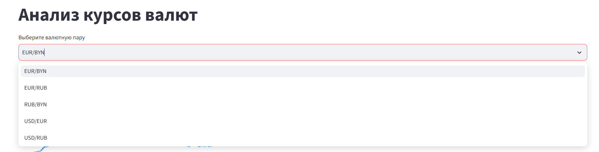
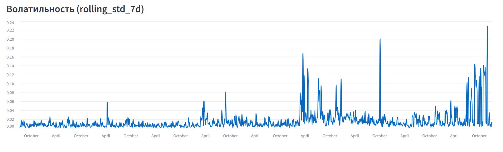
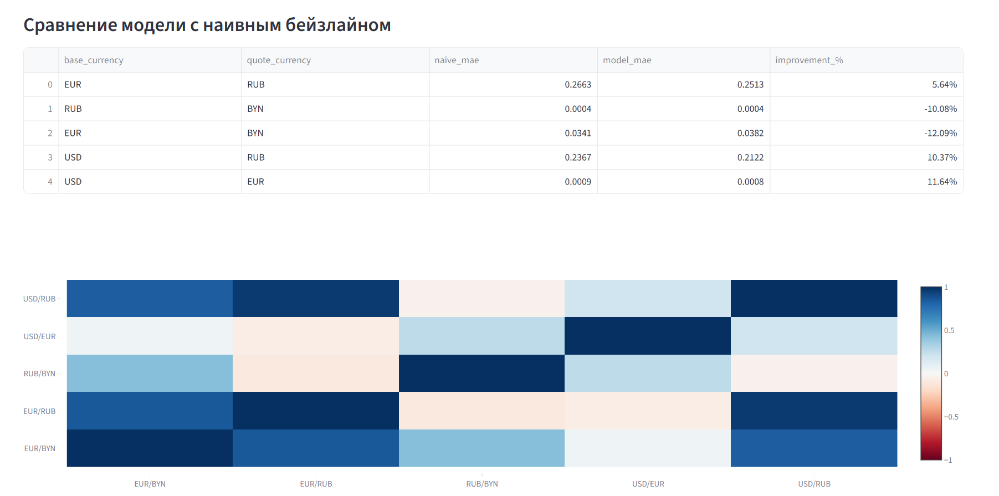

# Currency Analytics — анализ и прогноз курсов валют

Пет-проект на Python: сбор исторических курсов валют через публичное API, хранение в PostgreSQL,
расчёт признаков (волатильность, скользящие средние), обучение простой ML-модели для прогноза курса
на следующий день и сравнение её с наивным бейзлайном. Результаты визуализированы в интерактивном
дашборде на Streamlit.


## Архитектура

```
Frankfurter API (бесплатный, без ключа)
        │
        ▼
  Сбор данных (fetch_rates.py)
        │
        ▼
  PostgreSQL: exchange_rate_daily
        │
        ▼
  Расчёт фичей (build_features.py)
        │
        ▼
  PostgreSQL: rate_features
        │
        ▼
  Модель + наивный бейзлайн (build_predictions.py)
        │
        ▼
  PostgreSQL: rate_predictions
        │
        ▼
  Дашборд (dashboard.py, Streamlit)
```

## Стек

- **Python**: pandas, requests, scikit-learn
- **PostgreSQL** — хранилище всех стадий пайплайна (сырые данные, признаки, прогнозы)
- **SQLAlchemy / psycopg2** — подключение к БД
- **Streamlit** — интерактивный дашборд
- **pytest** — тесты на ключевые вычисления

## Структура репозитория

```
├── connection.py          # подключение к PostgreSQL (SQLAlchemy engine + psycopg2)
├── fetch_rates.py         # сбор исторических курсов через Frankfurter API
├── load.py                # очистка и загрузка сырых данных в БД
├── build_features.py      # расчёт признаков (returns, rolling avg/std, lags)
├── build_predictions.py   # наивный бейзлайн + модель + оценка качества
├── dashboard.py           # Streamlit-дашборд
├── tests/
│   └── test_features.py   # тесты на расчёт признаков
├── requirements.txt
└── .env.example
```

## Схема базы данных

**exchange_rate_daily** — сырые ежедневные курсы валют (date, base_currency, quote_currency, rate)

**rate_features** — признаки для модели: `daily_return`, `rolling_avg_7d`, `rolling_std_7d`,
`lag_1d`, `lag_7d`, с составным первичным ключом `(date, base_currency, quote_currency)` и
внешним ключом на `exchange_rate_daily`.

**rate_predictions** — результаты прогноза: фактический курс, прогноз модели, прогноз
наивного бейзлайна, название модели.

## Как запустить

1. Установить зависимости:
   ```bash
   pip install -r requirements.txt
   ```
2. Создать `.env` по образцу `.env.example` и указать параметры своей PostgreSQL:
   ```
   database=currency
   user=postgres
   password=...
   host=localhost
   port=5432
   ```
3. Применить схему БД (таблицы `exchange_rate_daily`, `rate_features`, `rate_predictions`).
4. Прогнать пайплайн по порядку:
   ```bash
   python fetch_rates.py
   python load.py
   python build_features.py
   python build_predictions.py
   ```
5. Запустить дашборд:
   ```bash
   streamlit run dashboard.py
   ```
6. Прогнать тесты:
   ```bash
   pytest tests/ -v
   ```

## Валютные пары в проекте

USD/EUR, USD/RUB, EUR/RUB, EUR/BYN, RUB/BYN — история с 2016 по 2026 год.

> Данные по BYN до деноминации (июль 2016) были исключены из анализа — до реформы белорусский
> рубль торговался в тысячи раз дешевле, что вносило фиктивные выбросы в расчёт волатильности
> и доходности.

## Результаты

Модель (Linear Regression, обучена отдельно на каждую валютную пару) сравнивалась с наивным
бейзлайном — прогнозом "курс завтра равен курсу сегодня":

| Пара | MAE наивного | MAE модели | Улучшение |
|------|-------------:|-----------:|----------:|
| USD/EUR | 0.000854 | 0.000755 | +11.6% |
| USD/RUB | 0.236750 | 0.212209 | +10.4% |
| EUR/RUB | 0.266333 | 0.251311 | +5.6% |
| EUR/BYN | 0.034095 | 0.038218 | −12.1% |
| RUB/BYN | 0.000392 | 0.000431 | −10.1% |

**Модель обходит наивный бейзлайн на 3 из 5 пар.** На парах с BYN модель проигрывает — за
тестовый период (последние 60 дней истории) курс EUR/BYN находился в устойчивом продолжительном
нисходящем тренде, при котором "вчерашнее значение" оказывается труднопревосходимым ориентиром
для модели, обученной на смеси разных рыночных режимов за 10 лет истории.

Этот результат показателен сам по себе: для валютных курсов, близких к модели случайного
блуждания, стабильно обходить наивный прогноз на всех парах сразу — не ожидаемый исход даже
для более сложных моделей.







## Ограничения и возможные улучшения

- Модель — простая линейная регрессия без подбора гиперпараметров.
- Test-период фиксирован (последние 60 дней).
- Автоматизация сбора свежих данных (Cron) пока не реализована.
- Дашборд не опубликован отдельно — запускается локально через `streamlit run`.

